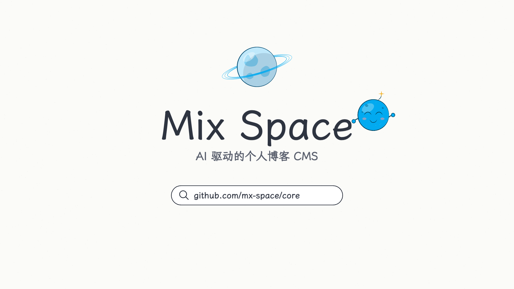

# Mix Space · Story Film



一部 2 分钟的手绘动画短片，讲 [Mix Space](https://github.com/mx-space/core) 从 2020 年的一张草稿长成今天的样子。主角 Dot 是 logo 上那颗小卫星。

A two-minute hand-drawn film about how Mix Space grew up, told by Dot, the little satellite from the logo.

- 行星是 Mix Space，一次提交点亮一盏灯（按 `mx-space/core` 每天的真实提交数），一个大版本一道光环。
- 四幕五种材质：铅笔草稿（2020）→ 墨线重写（2021）→ 平涂换脸（主题与 AI）→ 蓝图换芯（MongoDB → PostgreSQL、后台 React 重写、monorepo）→ logo 蓝（v14）。
- 画面上的 hash、日期、提交数都来自 git 历史，见 `OUTLINE.md` 的「依据」一列。

## 预览

浏览器直接打开 `dot.html`（无需服务器），页面即审片台：空格播放，`[` `]` 跳镜头，下方是逐镜分镜。

```bash
pnpm i                                                   # puppeteer-core, for rendering
node frames.mjs dot.html load                            # sanity check
node render-hq.mjs dot.html --width 3840 --fps 60        # 4K60 MP4 → out/ (needs Chrome + ffmpeg)
```

## 文件

| 文件 | 内容 |
|---|---|
| `OUTLINE.md` | 故事、幕、逐拍大纲与出处 |
| `shots.json` / `storyboard/` | 分镜数据与分镜页 |
| `cast-sheet.html` | 角色表：Dot、卫星、行星 |
| `dot-*.js` | 影片本体：角色、世界、各幕、配乐 |
| `timeline.json` / `dot-data.js` | 从 `mx-space/core` git 历史统计的每日提交数 |

## 致谢与许可

- 制作流程来自 [EverMind-AI/Raven](https://github.com/EverMind-AI/Raven) 的 `git-story-film` skill。
- 绘制引擎（`core.js`、`cels.js`、`studio.js`、`materials.js`、`render.mjs`）改编自 [alesha-pro/tools · hand-drawn-canvas-animation](https://github.com/alesha-pro/tools/tree/main/skills/hand-drawn-canvas-animation)，MIT，见 `LICENSE.hand-drawn-canvas-animation`。
- 字体：霞鹜文楷 LXGW WenKai、Comic Neue，均为 SIL OFL 1.1，许可证在 `fonts/`。
- 配乐由 Web Audio 实时合成，无外部音频素材。
